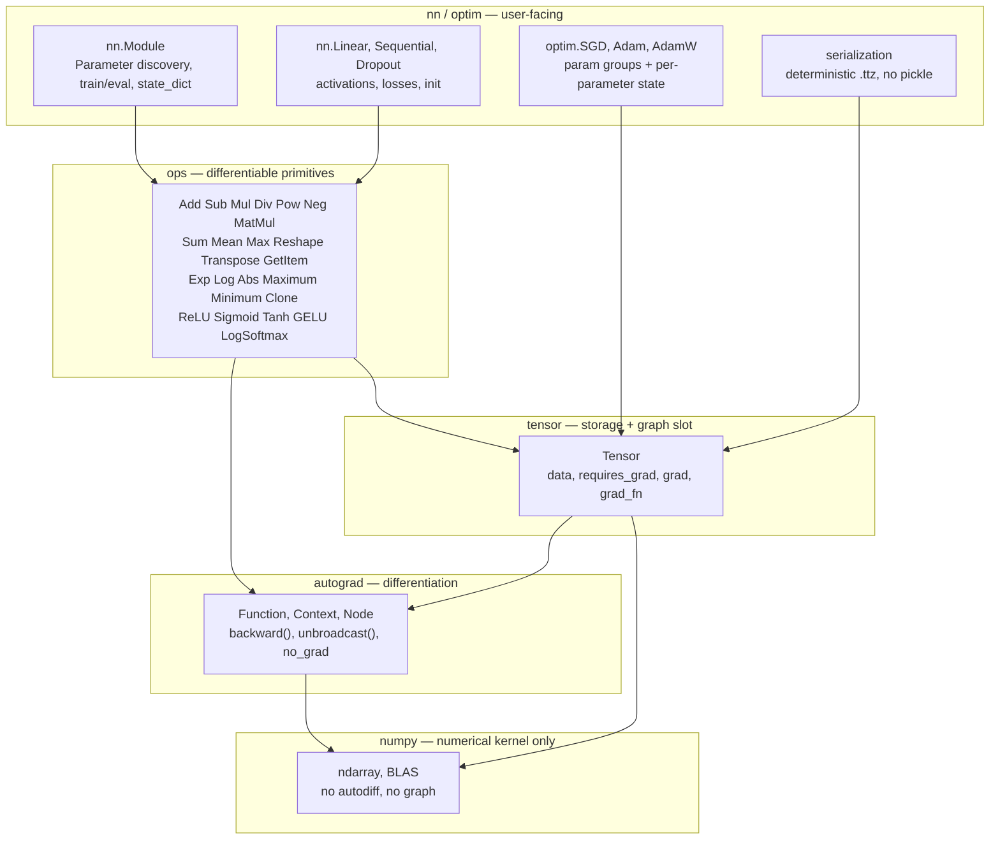
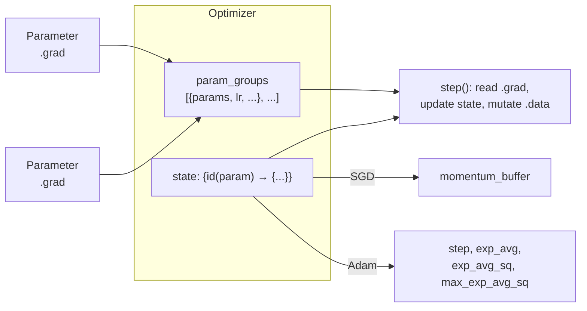

# Architecture

How TinyTorch is put together: the layering, the neural-network object model,
optimizer state, and the checkpoint format. For the autodiff engine itself see
[`autograd.md`](autograd.md).

---

## 1. Layering



The boundary that matters is the bottom one. **NumPy provides storage and
arithmetic; it provides no derivative information whatsoever.** Every `backward`
in `ops.py` is a hand-written derivative rule, and the graph, the traversal and
the accumulation are all TinyTorch's.

### Import cycle, and how it is broken

`ops.py` needs `Tensor`; `Tensor`'s operators need `ops`. The cycle is broken by
direction:

- `autograd.py` imports **nothing** from the package at module level. It refers
  to tensors structurally and imports `Tensor` inside `Function.apply`.
- `tensor.py` imports `autograd` at module level; its dunder methods do a
  function-local `from . import ops`.
- `ops.py` imports both at module level.

The local imports resolve through `sys.modules` after the first call, so the
cost is a dict lookup, not a re-import.

## 2. `Module` and `Parameter`

### Discovery by attribute interception

`Module.__setattr__` inspects what you assign:

```python
def __setattr__(self, name, value):
    if isinstance(value, Parameter):
        self._parameters[name] = value      # registered as learnable
    elif isinstance(value, Module):
        self._modules[name] = value         # registered as a child
    else:
        object.__setattr__(self, name, value)   # a plain attribute
```

So writing `self.weight = Parameter(...)` in `__init__` *is* the registration.
There is no metaclass, no decorator and no explicit registry call. `__getattr__`
handles the read side, looking in the three registries when normal lookup fails.

`Parameter` is a `Tensor` subclass whose only behavioural difference is
`requires_grad=True` by default — the **type** is what carries the meaning.
That is exactly the distinction needed to separate a trainable weight from a
constant buffer, since both are tensors living on a module:

| | in `parameters()` | in `state_dict()` | updated by an optimizer |
|---|---|---|---|
| `Parameter` | yes | yes | yes |
| buffer (`register_buffer`) | no | yes | no |
| plain attribute | no | no | no |

### Traversal

Everything else is a depth-first walk over `_modules`:

```
Sequential
├── "0" Linear      → 0.weight, 0.bias
├── "1" ReLU        → (no parameters)
└── "2" Linear      → 2.weight, 2.bias
```

`named_parameters()` **deduplicates by `id()`**. This matters for weight tying:
if one `Parameter` object is reachable under two names, an optimizer that saw it
twice would apply its update twice per step. There is a test for this.

### `train()` / `eval()`

A flag propagated to every descendant. Only layers whose *mathematics* differ
between fitting and inference read it — in TinyTorch that is `Dropout`, which
uses **inverted** dropout: it scales survivors by `1/(1-p)` during training so
that evaluation is a plain identity and needs no rescaling.

### `state_dict` / `load_state_dict`

`state_dict()` returns a flat `{qualified_name: ndarray}` of **copies**, so it is
a true snapshot that continued training will not mutate.

`load_state_dict()` copies **in place** (`tensor.copy_(value)`). This is
deliberate and load-bearing: an optimizer constructed before the load holds
references to those exact `Parameter` objects, along with momentum buffers keyed
by their `id()`. Rebinding the attributes instead would leave the optimizer
updating orphaned tensors while the model used different ones — a bug that
produces a model that simply stops learning, with no error.

## 3. Optimizers



**Parameter groups** let one optimizer train different parts of a model under
different hyperparameters (a lower learning rate for a pretrained trunk, no
weight decay on biases) without needing two optimizers.

**Per-parameter state** is keyed by `id(param)`, because the optimizer is handed
a bare iterable of tensors and never learns their names. State is created
**lazily**, on a parameter's first update — which is what makes "step 1"
detectable, and both SGD-with-momentum and Adam need to detect it:

- SGD seeds its momentum buffer with the gradient itself, not with zeros
  (seeding with zeros would halve the first step), and skips dampening on that
  step.
- Adam's bias correction divides by $1-\beta^t$, so it needs a genuine step
  counter $t$ — which is why the counter is real state that must be
  checkpointed.

`state_dict()` re-keys state from `id(param)` to the parameter's **position** in
the flattened group order, since `id()` is meaningless once a process exits.

### The update rules, as implemented

**SGD** (matching `torch.optim.SGD` exactly):

```
if weight_decay: g ← g + λθ
if momentum:
    buf ← g                       if this is the first step
    buf ← μ·buf + (1−τ)·g         otherwise
    g   ← g + μ·buf               if nesterov
    g   ← buf                     otherwise
θ ← θ − lr·g
```

**Adam** (matching `torch.optim.Adam` exactly):

```
t   ← t + 1
if weight_decay: g ← g + λθ
m   ← β₁m + (1−β₁)g
v   ← β₂v + (1−β₂)g²
v̂   ← max(v̂, v)                   if amsgrad
θ  ← θ − (lr / (1−β₁ᵗ)) · m / (√(v/(1−β₂ᵗ)) + ε)
```

Note `ε` sits *outside* the square root, and bias correction is applied as a
scale on the step rather than to `m` and `v` in place. Both details match
PyTorch, and both are verified step-by-step in `tests/test_torch_parity.py`.

**AdamW** applies `θ ← θ(1 − lr·λ)` directly instead of folding decay into the
gradient, so the decay is not divided by the adaptive denominator.

## 4. Initialization

The problem: a stack of linear maps multiplies variances, so a per-layer scale
$k$ gives $k^L$ after $L$ layers — exponential growth or decay. Initialization
picks the weight variance that makes $k \approx 1$.

| scheme | variance | assumption |
|---|---|---|
| Xavier / Glorot | $2/(\text{fan\_in} + \text{fan\_out})$ | activation ~linear near 0 (`tanh`, `sigmoid`) |
| Kaiming / He | $2/\text{fan\_in}$ | ReLU zeroes half the units, halving the variance |

`tests/test_nn.py` verifies this *behaviourally*, not just by checking a
formula: it propagates a signal through 12 ReLU layers and asserts that Kaiming
holds the activation scale while Xavier decays by more than 5x.

`nn.Linear`'s default matches `torch.nn.Linear` — `kaiming_uniform_(a=√5)`,
which works out to a bound of $1/\sqrt{\text{fan\_in}}$, with the bias drawn from
the same interval.

## 5. Serialization

### Why not pickle

`pickle` — and therefore `torch.save`'s default and `np.save(allow_pickle=True)`
— deserialises by **executing opcodes** that can import arbitrary modules and
call arbitrary callables. Loading an untrusted checkpoint is running untrusted
code. Model weights are routinely downloaded from the internet, so this is a
real attack surface.

### The `.ttz` format

A plain zip archive:

```
manifest.json          format tag, version, structure, per-array dtype/shape
arrays/0.npy           one .npy per array, written with allow_pickle=False
arrays/1.npy
...
```

Structure (nested dicts, lists, tuples, scalars, `None`) lives in the JSON
manifest with array leaves replaced by `{"__array__": n}` references. Loading
parses JSON and reads arrays — **no code is executed**, and a malformed or
unknown manifest is rejected rather than interpreted. Object-dtype arrays, which
could only be stored via pickle, are refused at save time.

### Determinism

Saving the same state twice produces **byte-identical** files:

- dict keys are emitted in insertion order, and the manifest records that order;
- every zip entry gets a fixed timestamp (1980-01-01) instead of the current time;
- compression is fixed to deflate level 6;
- JSON uses fixed separators.

This makes checkpoints hashable, diffable and cache-friendly, and lets tests
assert byte equality rather than approximate equality. `tests/test_serialization.py`
asserts both that identical state round-trips to identical bytes *and* that a
change of `1e-7` in one weight changes them — determinism achieved by ignoring
content would be worthless.

## 6. Package layout

```
tinytorch/
├── pyproject.toml            hatchling, ruff, mypy and pytest config
├── README.md  LICENSE
├── src/tinytorch/
│   ├── __init__.py           public API surface
│   ├── autograd.py           Function, Context, Node, backward, unbroadcast, no_grad
│   ├── tensor.py             Tensor: storage, requires_grad, grad, grad_fn, operators
│   ├── ops.py                every differentiable primitive + functional API
│   ├── creation.py           zeros/ones/randn/... and the global RNG
│   ├── gradcheck.py          finite-difference verification
│   ├── serialization.py      deterministic .ttz save/load
│   ├── nn/
│   │   ├── module.py         Module, Parameter
│   │   ├── layers.py         Linear, Sequential, Dropout, Flatten, Identity
│   │   ├── activations.py    ReLU, Sigmoid, Tanh, GELU, Softmax, LogSoftmax, LeakyReLU
│   │   ├── losses.py         MSE, L1, NLL, CrossEntropy, BCE
│   │   ├── init.py           zeros/ones/uniform/normal/Xavier/Kaiming
│   │   └── functional.py     stateless forms
│   └── optim/
│       ├── optimizer.py      base: param groups + per-parameter state
│       ├── sgd.py            SGD (+ momentum, Nesterov, dampening, weight decay)
│       └── adam.py           Adam, AdamW (+ amsgrad)
├── tests/                    391 tests
├── examples/                 6 runnable scripts
├── benchmarks/               overhead characterisation vs PyTorch
├── docs/
└── .github/workflows/ci.yml
```

## 7. Design decisions and their costs

| Decision | Bought | Cost |
|---|---|---|
| Gradients are `ndarray`, not `Tensor` | A short, readable engine that cannot accidentally extend the graph from inside `backward` | No double backward |
| `unbroadcast` in the engine, not per-op | Every op gets broadcasting right for free | An op returning a deliberately odd shape has no escape hatch |
| Config as keyword-only args | `backward` returns exactly one gradient per positional input, unambiguously | Ops cannot take a tensor in a keyword slot |
| Iterative traversal | Arbitrarily deep graphs work | Slightly more code than recursion |
| `float32` default, `float64` in tests | Matches PyTorch's default and real training practice | Gradcheck must explicitly refuse `float32` |
| In-place `load_state_dict` | Optimizers survive a checkpoint load | Shapes must match exactly |
| NumPy as the only dependency | Installs anywhere in seconds; the autodiff is unambiguously ours | No GPU, no fusion, no custom kernels |
