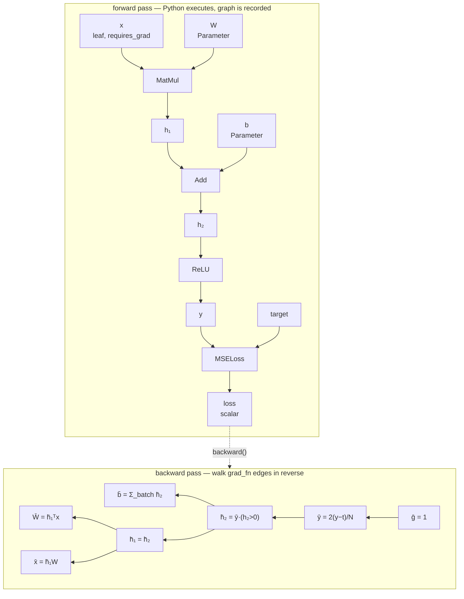
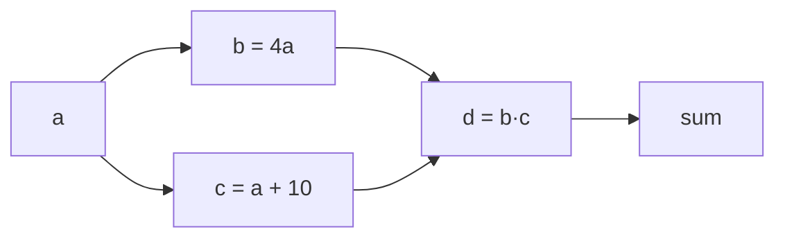

# Reverse-mode automatic differentiation

This is the document to read if you want to understand how TinyTorch actually
works. It explains what a dynamic computation graph is, why reverse mode is the
right algorithm for training neural networks, and how the chain rule,
gradient accumulation and broadcasting are implemented.

---

## 1. Three ways to differentiate

| Approach | How | Why not |
|---|---|---|
| **Symbolic** | Manipulate the expression algebraically | Expression swell: the derivative of a deep composition is exponentially larger than the function |
| **Numerical** | `(f(x+h) - f(x-h)) / 2h` | One function evaluation *per parameter*; and it is inexact (see [gradient checking](#8-gradient-checking)) |
| **Automatic** | Apply the chain rule to the *recorded* sequence of primitive operations | This is what TinyTorch does |

Automatic differentiation is neither symbolic nor numerical. It computes exact
derivatives (to floating-point precision) by composing the known derivatives of
a small set of primitives, at a cost proportional to the original computation.

## 2. Forward mode vs reverse mode

Any program computing $y = f(x)$ with $f: \mathbb{R}^n \to \mathbb{R}^m$ has a
Jacobian $J \in \mathbb{R}^{m \times n}$. Autodiff never builds $J$; it computes
products with it.

- **Forward mode** computes $J v$ — one column of $J$ per pass. Cost: $O(n)$ passes.
- **Reverse mode** computes $v^\top J$ — one row of $J$ per pass. Cost: $O(m)$ passes.

Training a network means differentiating a **scalar** loss with respect to
**millions** of parameters: $m = 1$, $n$ huge. Reverse mode gets the entire
gradient in a single backward pass, which is the whole reason it dominates deep
learning. That asymmetry is not an implementation detail — it is why the API is
`loss.backward()` and not `parameters.forward_diff()`.

The price is memory: reverse mode must keep intermediate values alive from the
forward pass until the backward pass uses them. Forward mode needs none of that.

## 3. The dynamic graph

TinyTorch is **define-by-run**. There is no graph object you construct and then
execute; the graph *is* the record of what already happened.

Every operation goes through `Function.apply`, which does four things:

```python
@classmethod
def apply(cls, *args, **kwargs):
    raw = tuple(a.data if isinstance(a, Tensor) else a for a in args)  # 1. unwrap
    ctx = Context()
    out_data = cls.forward(ctx, *raw, **kwargs)                        # 2. compute

    requires_grad = is_grad_enabled() and any(
        isinstance(a, Tensor) and a.requires_grad for a in args
    )
    out = Tensor(out_data, requires_grad=requires_grad)                # 3. wrap
    if requires_grad:
        out.grad_fn = Node(cls, ctx, args)                             # 4. record
    return out
```

Step 4 is the entire graph construction. `out.grad_fn` remembers *which*
function produced this tensor, *what* it was given, and *what* it stashed for
the derivative. Following `grad_fn.inputs` from any tensor walks backwards
through everything that contributed to it.

Because the graph is built by running Python, control flow is free — a loop
that runs a different number of times per batch, an `if` on a data value, a
recursive function — all of it records correctly, because recording *is*
running.



Solid arrows are the forward data flow; the dashed arrow is where
`backward()` starts. Note that the backward pass has exactly the same shape as
the forward pass, traversed in the opposite direction — that structural mirror
is what makes the implementation short.

## 4. The chain rule, as implemented

For a composition $L = f_k(f_{k-1}(\cdots f_1(x)))$ the chain rule gives

$$\frac{\partial L}{\partial x} = \frac{\partial L}{\partial u_k}\frac{\partial u_k}{\partial u_{k-1}}\cdots\frac{\partial u_1}{\partial x}$$

Reverse mode evaluates this product **right-to-left is wrong; left-to-right is
right** — that is, starting from $\partial L/\partial u_k = 1$ and multiplying
by each local Jacobian in turn. Each step is a *vector*-matrix product rather
than a matrix-matrix product, which is where the efficiency comes from.

In code, each `Function.backward` implements exactly one of those local
factors — a **vector-Jacobian product** (VJP). It is handed
$\bar u = \partial L/\partial u$ (the gradient flowing in from above) and
returns $\bar x = \bar u \cdot \partial u/\partial x$ for each input:

```python
class Mul(Function):
    @staticmethod
    def forward(ctx, a, b):
        ctx.save_for_backward(a, b)   # backward needs both operands
        return a * b

    @staticmethod
    def backward(ctx, g):
        a, b = ctx.saved_tensors
        return g * b, g * a           # ∂(ab)/∂a = b,  ∂(ab)/∂b = a
```

No Function ever materialises a Jacobian matrix. `Mul`'s true Jacobian is a
diagonal matrix; multiplying by it is elementwise scaling, so that is what the
code does. `LogSoftmax`'s Jacobian is dense and $C \times C$ per row, but its VJP
collapses to `g - exp(out) * g.sum(axis)` — one pass, no matrix.

### `Context`: the bridge between the two passes

`forward` runs and is gone. Anything `backward` needs must be stashed:

```python
class Exp(Function):
    @staticmethod
    def forward(ctx, a):
        out = np.exp(a)
        ctx.save_for_backward(out)    # d/dx e^x = e^x — save the *output*
        return out

    @staticmethod
    def backward(ctx, g):
        (out,) = ctx.saved_tensors
        return g * out
```

Choosing *what* to save is a real memory decision. `Exp` saves its output
(1 array); it could instead save its input and recompute, trading time for
memory. This is exactly the knob that gradient checkpointing turns in large
models.

## 5. Topological traversal

The graph is a DAG, not a chain — a tensor can feed several consumers. Getting
the order wrong produces silently wrong gradients: if a tensor is processed
before all of its consumers have contributed, it propagates a partial sum.

`autograd.backward` therefore:

1. builds a post-order DFS ordering of every tensor reachable from the root,
2. walks it **in reverse**, so a tensor is only processed once every consumer
   has already contributed, and
3. accumulates each input's incoming gradients in a `pending` dict along the way.

```python
for tensor in reversed(order):
    grad = pending.pop(id(tensor), None)
    if grad is None:
        continue                        # an unreachable branch of the DAG

    node = tensor.grad_fn
    if node is None or tensor.retains_grad:
        tensor._accumulate_grad(grad)   # a leaf: this is where gradient lands
    if node is None:
        continue

    for inp, g in zip(node.inputs, node.apply_backward(grad), strict=True):
        if g is None or not _is_differentiable_tensor(inp):
            continue
        g = unbroadcast(np.asarray(g), inp.data.shape)
        pending[id(inp)] = pending.get(id(inp), 0) + g   # <- the fan-in sum
```

Two implementation notes worth the attention:

- **The traversal is iterative, not recursive.** A 5000-layer chain would
  exhaust CPython's ~1000-frame recursion limit. There is a test for this.
- **Tensors are keyed by `id()`.** `Tensor.__eq__` is an elementwise op
  returning a tensor, so tensors are not usable as value-keyed dict keys.
  Identity is also the semantically correct key: two tensors with equal
  contents are still different nodes.

### Diamonds and reuse



`a` has two consumers. The traversal visits `a` exactly once, *after* both `b`
and `c` have pushed their contributions into `pending[id(a)]`, and the two are
summed. That is the multivariable chain rule
($\bar a = \bar b\,\partial b/\partial a + \bar c\,\partial c/\partial a$) falling
out of the data structure rather than being special-cased.

## 6. Gradient accumulation

`backward` **adds** into `.grad`; it never overwrites.

```python
def _accumulate_grad(self, grad):
    if self.grad is None:
        self.grad = grad.copy()
    else:
        self.grad = self.grad + grad
```

This has two consequences, one useful and one dangerous.

**Useful:** you can split a batch that does not fit in memory into micro-batches,
call `backward()` on each, and step once. The result is identical to a
full-batch step:

```python
optimizer.zero_grad()
for chunk in micro_batches:                 # 4 chunks
    (loss_fn(model(chunk.x), chunk.y) / 4).backward()   # note the / 4
optimizer.step()
```

**Dangerous:** forget `zero_grad()` and you silently train on the running sum of
every gradient since the start of the run. Nothing errors; the model just
learns badly. This is why `zero_grad()` is a required line in every training
loop, and why the default is `set_to_none=True` — a missing gradient shows up as
`None` rather than a plausible-looking zero.

## 7. Broadcast gradient reduction

Broadcasting is the subtlest correctness issue in a small autodiff engine.

When NumPy computes `x + b` with `x.shape == (32, 10)` and `b.shape == (10,)`,
it conceptually *copies* `b` 32 times. A copy is a fan-out in the graph, and

> **the adjoint of a fan-out is a sum.**

So the gradient arriving at `b` has shape `(32, 10)` and must be summed down to
`(10,)`. Miss this and you get a shape error at best, and a wrong gradient at
worst.

TinyTorch handles it in **one place** — `autograd.unbroadcast`, called by the
engine on every gradient before accumulation — so no individual op has to think
about it:

```python
def unbroadcast(grad, shape):
    if grad.shape == shape:
        return grad

    # 1. Collapse the leading axes NumPy invented.
    extra_dims = grad.ndim - len(shape)
    if extra_dims > 0:
        grad = grad.sum(axis=tuple(range(extra_dims)))

    # 2. Collapse axes that were stretched from extent 1.
    stretched = tuple(i for i, d in enumerate(shape) if d == 1 and grad.shape[i] != 1)
    if stretched:
        grad = grad.sum(axis=stretched, keepdims=True)
    return grad
```

| forward | gradient in | after unbroadcast | why |
|---|---|---|---|
| `(32,10) + (10,)` | `(32,10)` | `(10,)` | leading axis was invented |
| `(32,10) + (1,10)` | `(32,10)` | `(1,10)` | axis 0 stretched from 1 |
| `(4,1) * (1,3)` | `(4,3)` | `(4,1)` / `(1,3)` | each operand stretched on a different axis |
| `(2,4,3) * ()` | `(2,4,3)` | `()` | scalar broadcast everywhere |

The sum-preservation property (`unbroadcast(g, s).sum() == g.sum()`) is
directly asserted in the tests for every one of these cases.

## 8. Gradient checking

The engine's own claim is verified two independent ways.

**Against finite differences** (`tinytorch.gradcheck`) — framework-independent,
and would catch an error that TinyTorch and PyTorch happened to share:

$$\frac{\partial f}{\partial x_i} \approx \frac{f(x + h e_i) - f(x - h e_i)}{2h}$$

The central difference has $O(h^2)$ truncation error, versus $O(h)$ for a
forward difference — worth the extra evaluation. But precision, not truncation,
is the binding constraint: subtracting two nearly equal numbers destroys
significant digits, so the total error behaves like

$$O(h^2) + O(\varepsilon_{\text{machine}}/h)$$

In `float64` ($\varepsilon \approx 2.2\times10^{-16}$) the optimum sits near
$h \approx 10^{-6}$, leaving ~7 good digits. In `float32`
($\varepsilon \approx 1.2\times10^{-7}$) **there is no usable window at all** —
which is why `gradcheck` raises a `TypeError` rather than quietly producing
garbage if you hand it `float32`.

**Against PyTorch** — catches convention differences that finite differences
cannot see, because they are invisible in the limit: the subgradient at a kink
(`relu'(0)`), tie-breaking in `maximum`, Adam's exact bias-correction ordering,
and PyTorch's habit of seeding SGD's momentum buffer with the first gradient
rather than with zeros.

## 9. What this engine deliberately does not do

- **Double backward.** Gradients are `np.ndarray`, not `Tensor`, so the backward
  pass records no graph and $\partial^2$ is unavailable. This rules out
  gradient penalties (WGAN-GP) and MAML-style meta-learning. Making it work
  would mean expressing every `backward` in terms of `Tensor` ops — a real
  change, and a large one; the current design was chosen because it makes the
  engine much easier to read and impossible to accidentally extend the graph
  from inside a backward pass.
- **In-place operations on graph tensors.** There is no version counter, so
  mutating a tensor that a saved `Context` still references would silently
  corrupt its gradient. `detach()` shares storage precisely so you can opt into
  that, knowingly.
- **Graph-level optimisation.** No fusion, no dead-node elimination, no
  rematerialisation. Every op allocates its own output.
- **Anything but CPU + NumPy.** No devices, no dtypes beyond what NumPy offers,
  no distributed training.

## See also

- [`architecture.md`](architecture.md) — package layout, `Module`/`Parameter`
  discovery, optimizer state and the serialization format
- `src/tinytorch/autograd.py` — the engine, ~380 lines including docs
- `tests/test_autograd.py` — engine semantics
- `tests/test_gradcheck.py` — every operator verified numerically
